# Web Scraping CDL Seasons from 2021–2024

## Table of Contents
1. [Description](#description)
2. [Installation](#installation)
3. [Data Collection](#data-collection)
4. [Data Conversion](#data-conversion)
5. [Data Cleaning](#data-cleaning)
6. [Results](#results)
7. [Future Work](#future-work)

## Description
This project involves scraping data for each team in the Call of Duty League (CDL) from the 2021–2024 seasons. The data collected will serve as a foundation for further analysis in a subsequent project. The first season of the CDL (2020) is excluded due to inconsistencies with later seasons, largely due to the impact of the COVID-19 pandemic. These inconsistencies include differences in points distribution, tournament formats, and the fact that many events were held online.

## Installation
### Python
1. Install pip: Ensure you have pip installed to manage and install python libraries.
   
   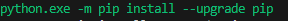

3. Install requests:  this will allow us to get access to the webpages we want to scrape

   

   
5. Install pandas:  This is used to structure the scraped data into data frames

   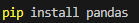

### SQL
- Install SQL Server Management Studio (SSMS) : Required for managing and querying the collected data in a SQL database

## Data Collection
The data collection process involved web scarping five different components for each CDL season (2021 – 2024):

1. **Webpage Access:**
   - Used the `requests` library to access the necessary webpages. This was crucial for obtaining the information needed for scraping.
   - Used `BeautifulSoup` to parse the HTML.
   - Used `Pandas` to structure the data into data frames.

     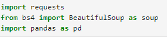

2. **Points Distribution:**
   - Scraped the points distribution data to understand how many points each team accumulated throughout the season via qualifiers and tournaments.
   - This data helped identify the tournament winners for each season.

     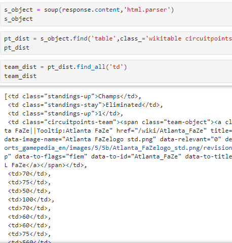

3. **COD Champs Information:**
   - Scraped data on the COD Champs, the final and most significant tournament of the season.
   - This included the teams that participated, their rosters, final placements, and prize money.

     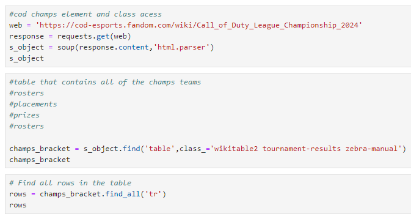

4. **LAN/Major Tournaments:**
   - Scraped data on LAN/Major Tournaments, including map records and series records.
   - A loop was used to navigate through the URLs, extracting data from specific HTML classes.
  
     
     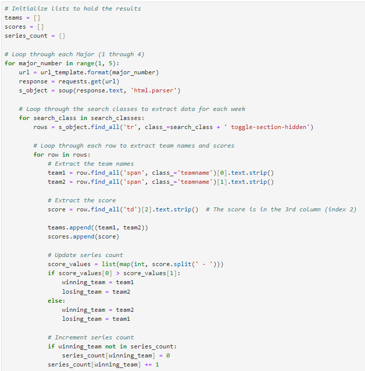

5. **Online Qualifiers:**
   - Scraped data on the Online qualifiers, including map records and series records.
   - A loop was used to navigate through the URLs, extracting data from specific HTML classes.

     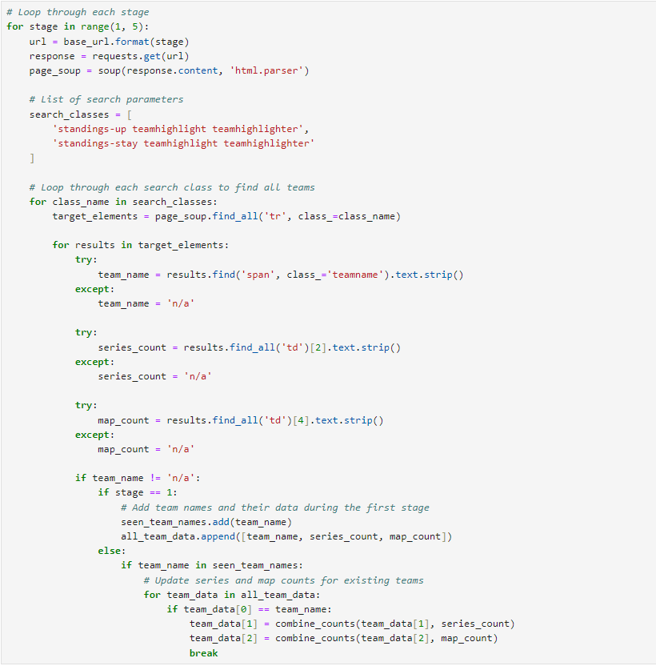

6. **Data Integration:**
   - After collecting data from all sources, the data was combined into a single data frame.
   - This combined data frame was exported as an Excel sheet for further analysis.

     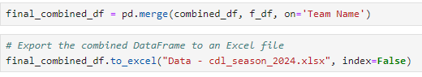

## Data Conversion

1. **Tournament Placing Columns:**
   - After scraping the points distribution data and organizing it into a data frame, I focused on creating the LAN Tournament Placing columns. Based on the points each team earned during specific major tournaments, I determined their placements. For example, if a team earned 100 points in a specific season, this would translate to a "1" in the tournament wins column.

     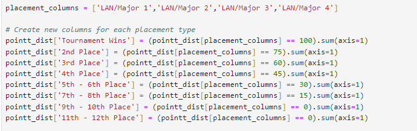

2. **Map and Series Win Percentages:**
   - This analysis was conducted for both online qualifiers and LAN/Major tournaments to calculate each team’s win percentage. These columns were created to identify which teams performed better in online qualifiers versus LAN events, providing insight into where each team excelled.

     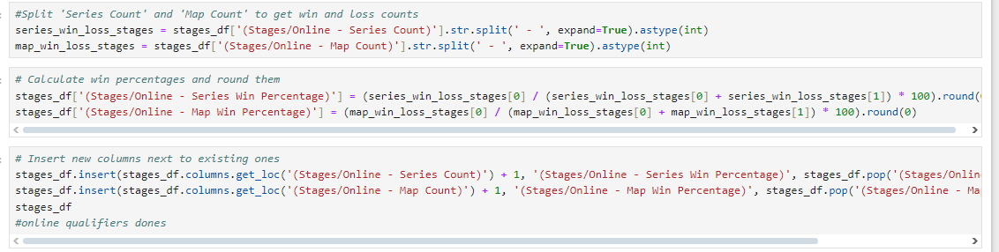

3. **Converting Excel Files to CSV:**
   - While I initially worked with Excel files because they are more user-friendly, I encountered issues when importing them into SQL. To resolve this, I converted the Excel files to CSV format, which simplified the importing process into SQL.

   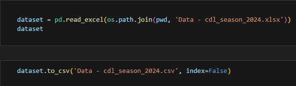

## Data Cleaning

1. **Correcting Misplaced Data:**
   - While scraping data for Call of Duty (CoD) Champs, some of the data was misaligned and ended up in incorrect columns. I addressed this by accessing the affected columns and manually adjusting the values to ensure they were correctly placed. Correcting team names made combining data frames easier.

     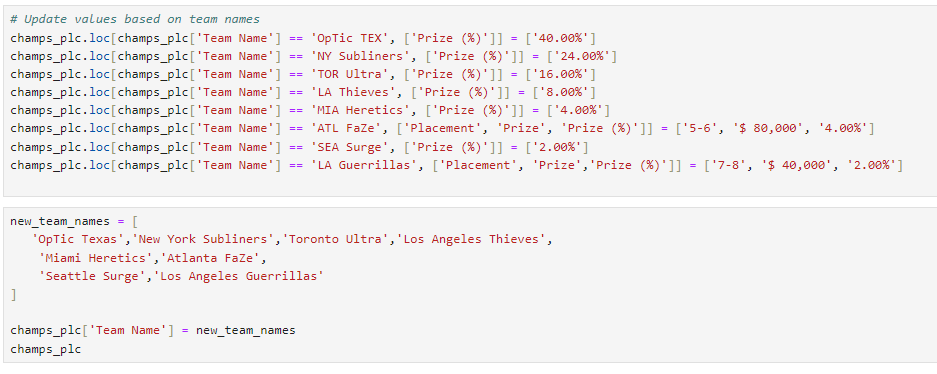

2. **Consistent Data Types in SQL:**
   - Before importing and combining all the seasons' data into a single database, I ensured that each dataset had consistent data types. This step was crucial to facilitate the smooth combination of all seasons into one comprehensive dataset.

3. **Handling Series and Map Count Formatting Problems:**
   - I encountered issues with the total series and map counts where values were formatted as "34 - 7", which led to problems during data export, sometimes even being interpreted as dates. To resolve this, I split these columns into separate "wins" and "losses" columns, so the data now appears as two distinct values (e.g., 34 and 7).

4. **Creating New Columns and Dropping Old Ones:**
   - After splitting the series and map counts, I created new columns to store these corrected values and dropped the old columns that were causing issues.
     
     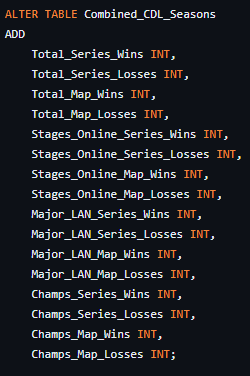

5. **Cleaning Champs Roster Columns:**
   -	Many Champs roster entries were imported with commas separating the player names, which caused the names to be split into new columns upon data export. I standardized the separators by replacing commas with semicolons, ensuring the names stayed together in a single column

     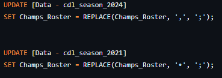
     
## Results

The final result is a comprehensive dataset covering the 2021–2024 CDL seasons for all participating teams. This dataset includes detailed records of online and LAN performances, tournament placements, final season rankings, points accumulated throughout the season, and performance in the Call of Duty Champs. The dataset serves as a valuable resource for in-depth analysis of team performance across different environments and stages of competition.

## Future Work

With the complete dataset now in Excel, the next steps involve conducting detailed analyses of team performances. For example, you could investigate which teams excelled in online play compared to LAN tournaments, or track performance trends across different seasons. This analysis will provide deeper insights into team strategies and overall competitiveness in the CDL.
